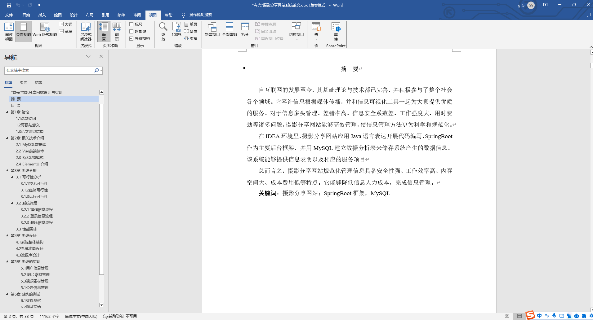
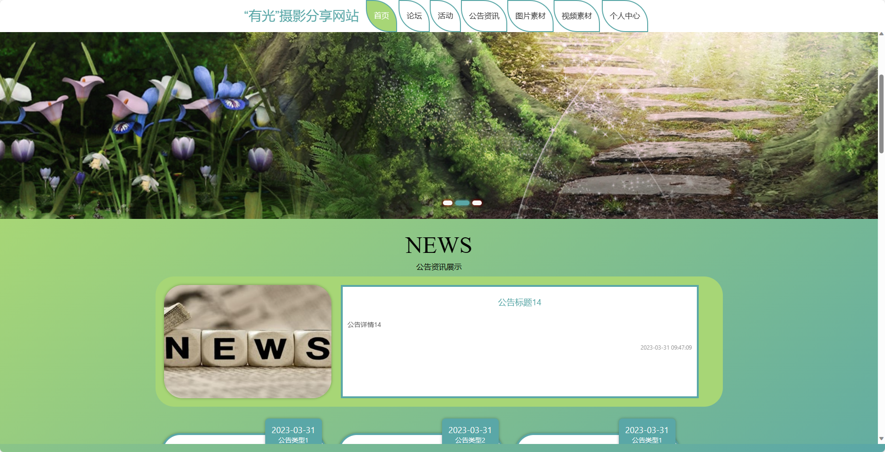
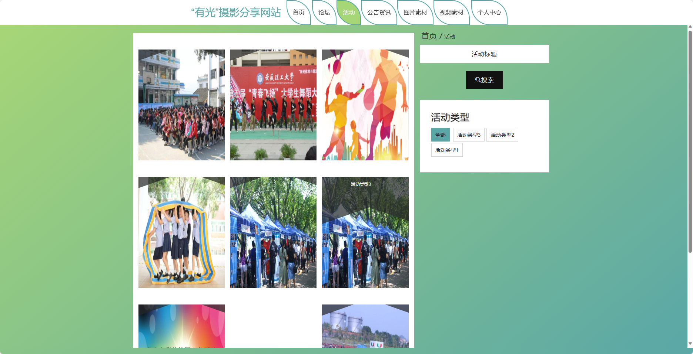
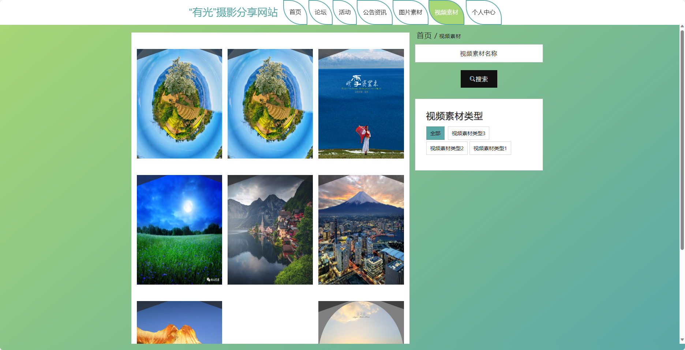
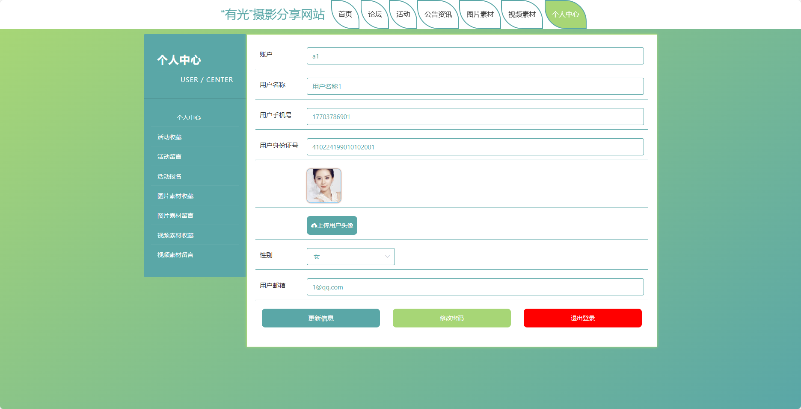
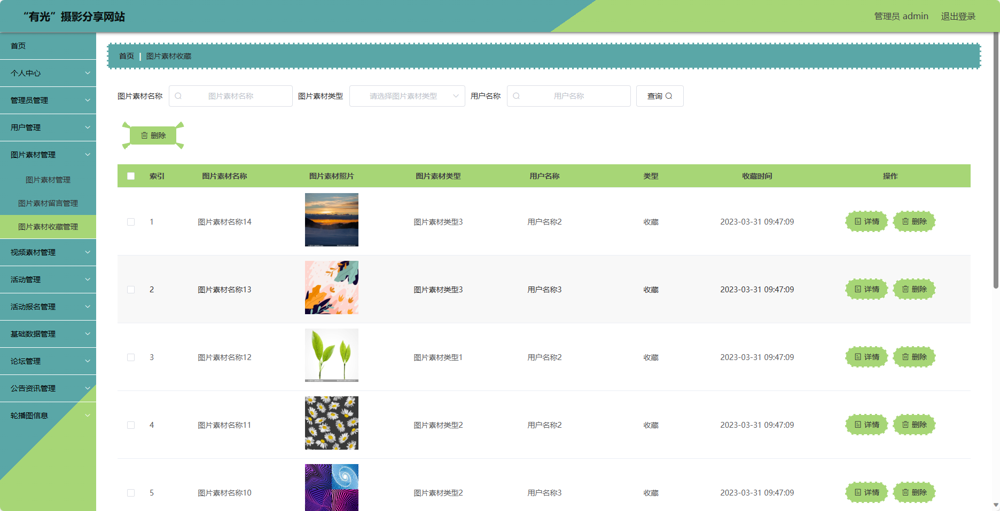

## 271.有光摄影分享网站系统(程序+报告)

- <b>完整代码获取地址：从戎源码网 ([https://armycodes.com/](https://armycodes.com/))</b>
- <b>技术探讨、资料分享，请加QQ群：692619798</b> 
- <b>作者微信：19941326836  QQ：952045282</b> 
- <b>承接计算机毕业设计、Java毕业设计、Python毕业设计、深度学习、机器学习</b>
- <b>选题+开题报告+任务书+程序定制+安装调试+论文+答辩ppt 一条龙服务</b>
- <b>所有选题地址 ([https://github.com/YuLin-Coder/AllProjectCatalog](https://github.com/YuLin-Coder/AllProjectCatalog)) </b>

## 项目介绍
基于springboot框架实现的有光摄影分享网站，系统包含两种角色：管理员、用户,系统分为前台和后台两大模块，主要功能如下。

### 【管理员】:
- 个人中心: 管理员可以查看和编辑个人信息。
- 管理员管理: 管理员可以对其他管理员进行管理，
- 用户管理: 管理员可以对用户进行管理，
- 图片素材管理: 管理员可以管理网站上的图片素材，
- 视频素材管理: 管理员可以管理网站上的视频素材，
- 活动管理：管理员可以创建、编辑和删除活动，
- 活动报名管理：管理员可以查看和管理用户对活动的报名情况，
- 基础数据管理：管理员可以管理网站的基础数据。
- 论坛管理：管理员可以管理网站的论坛板块。
- 公告资讯管理：管理员可以管理网站的公告资讯。

### 【前台】:
- 首页：展示网站的精选内容和最新活动信息。
- 论坛：用户可以在论坛板块中发帖、回帖。
- 活动：用户可以浏览和参加网站上发布的各类摄影相关活动。
- 公告资讯：用户可以查阅网站发布的摄影行业资讯和公告信息。
- 图片素材：用户可以浏览和搜索网站上的图片素材。
- 视频素材：用户可以浏览和搜索网站上的视频素材。

### 【用户】:
- 个人中心：用户可以查看和编辑个人信息。
- 活动收藏：用户可以收藏自己感兴趣的活动。
- 活动留言：用户可以在活动页面中留言和评论，。
- 活动报名：用户可以报名参加感兴趣的活动。
- 图片素材收藏：用户可以收藏喜欢的图片素材。
- 图片素材留言：用户可以在图片素材页面中留言和评论。
- 视频素材收藏：用户可以收藏喜欢的视频素材。
- 视频素材留言：用户可以在视频素材页面中留言和评论。

## 项目技术
- 编程语言：Java
- 数据库：MySQL
- 项目管理工具：Maven
- 前端技术：HTML、CSS、JavaScript、Jquery、Vue
- 后端技术：Spring、SpringMVC、MyBatis

## 运行环境
- JDK版本：JDK1.8及以上
- 开发工具：IDEA、Ecplise、Myecplise都可以
- 数据库: MySQL5.7及以上
- Maven：maven3.0及以上
- Node：14.14.0及以上

## 运行截图

